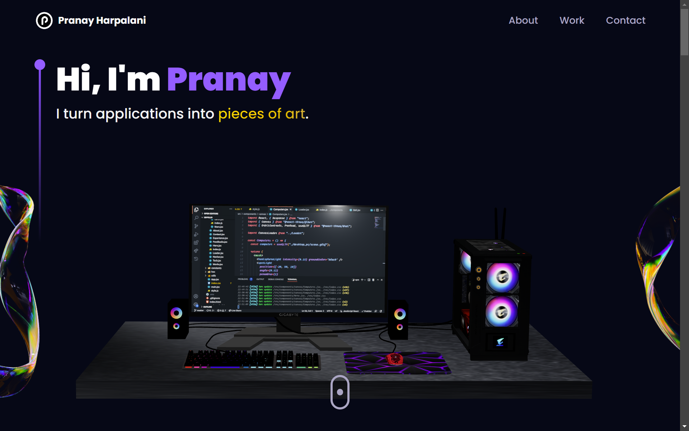
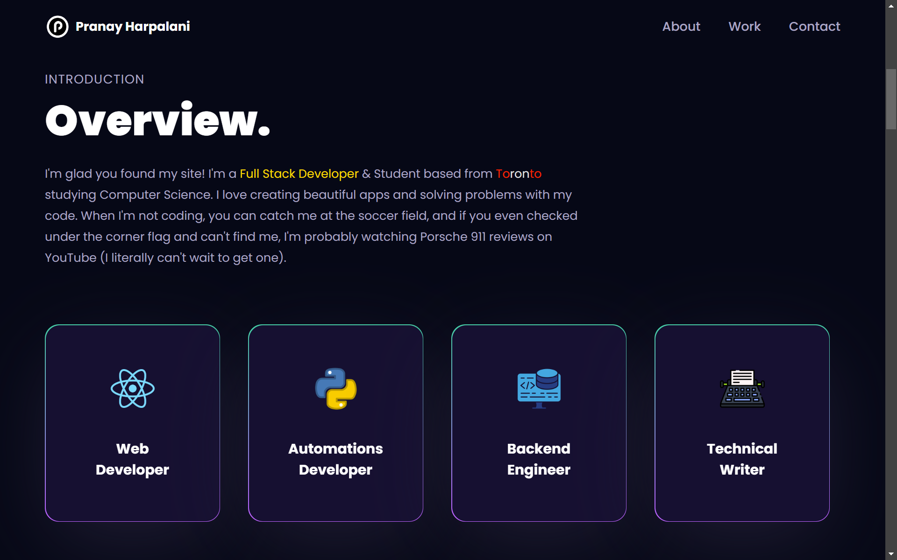
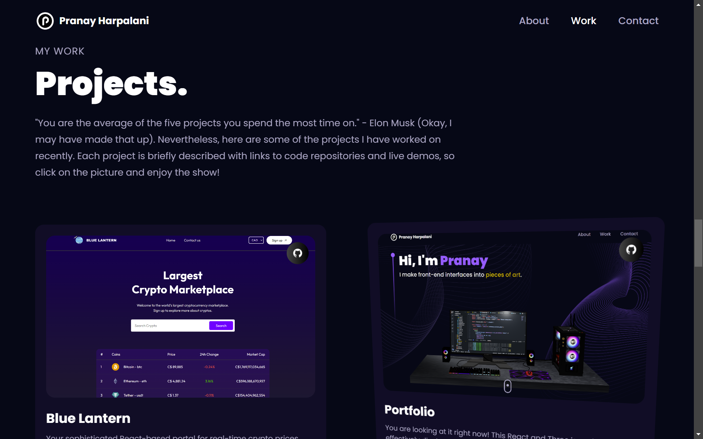
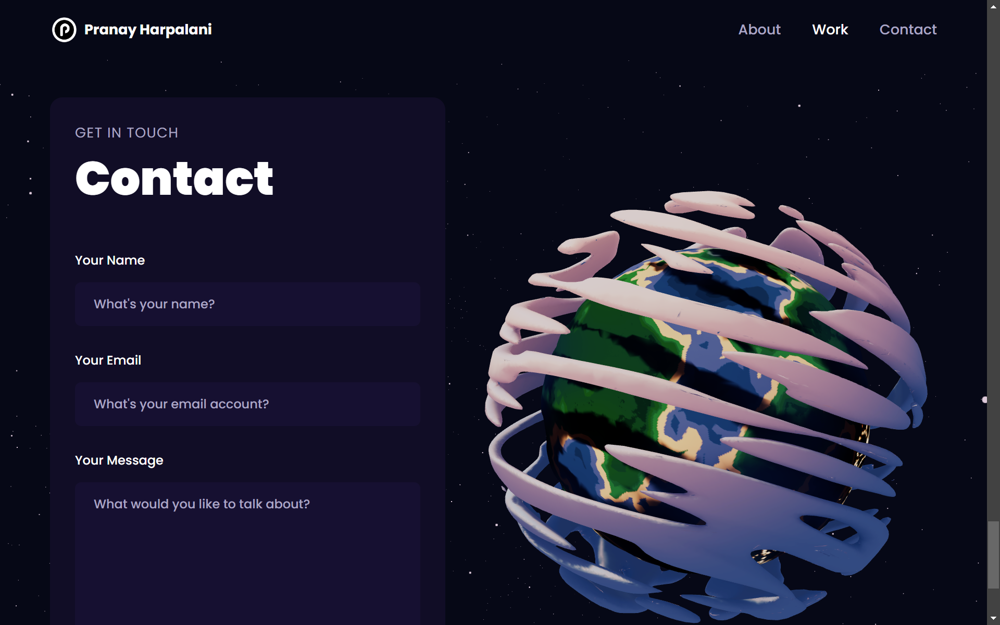

# My Portfolio

https://github.com/pharpala/Blue-Lantern/assets/128100428/085b573f-3483-45df-8335-db9b54905389

## Table of Contents

- [Introduction](#introduction)
- [Features](#features)
- [Technology Stack](#technology-stack)
- [Usage](#usage)
- [Screenshots](#screenshots)
- [Contributing](#contributing)

## Introduction

Welcome to my portfolio! This project is a showcase of my skills and projects. It features an interactive user interface with 3D models and animations, all designed to provide a smooth and engaging experience. The portfolio is responsive and works well on all devices, ensuring that it looks great whether you're on a desktop, tablet, or mobile phone.

## Features

- Interactive 3D models and animations.
- Responsive design for all devices.
- Showcases a variety of projects.
- Easy navigation and user-friendly interface.
- Contact form for inquiries.

## Technology Stack

- **React**: Frontend framework for building the user interface.
- **JavaScript**: Writing the functionality and application code.
- **Three.js**: Used for creating 3D models and animations.
- **Framer Motion**: Library for animations.
- **Tailwind CSS**: Utility-first CSS framework for styling.
- **Vercel**: Deployment of the app.

## Usage

1. Open the application in your browser by clicking [here](https://pranayharpalani.com/).
2. Navigate through the different sections to view my projects and skills.
3. Use the contact form to get in touch with any inquiries.

## Screenshots

Here are some screenshots of the application in action:

### Home Screen

### About Section

### Projects Section

### Contact Section

## Contributing

Contributions are welcome! Please open an issue or submit a pull request for any improvements or bug fixes. For major changes, please open an issue first to discuss what you would like to change.
